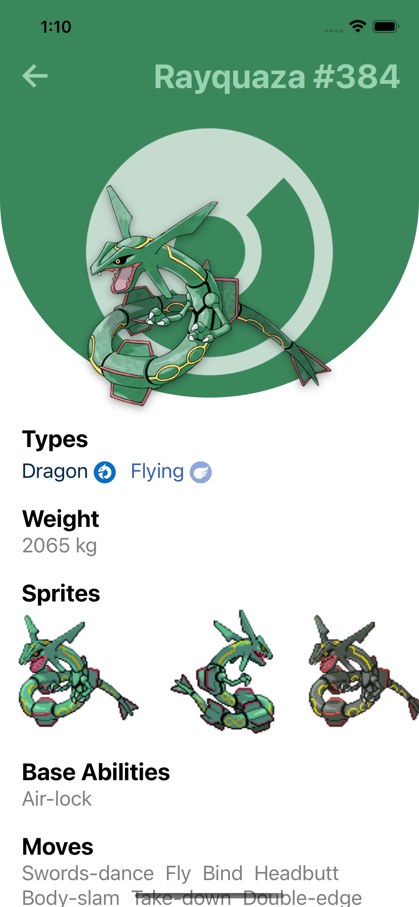
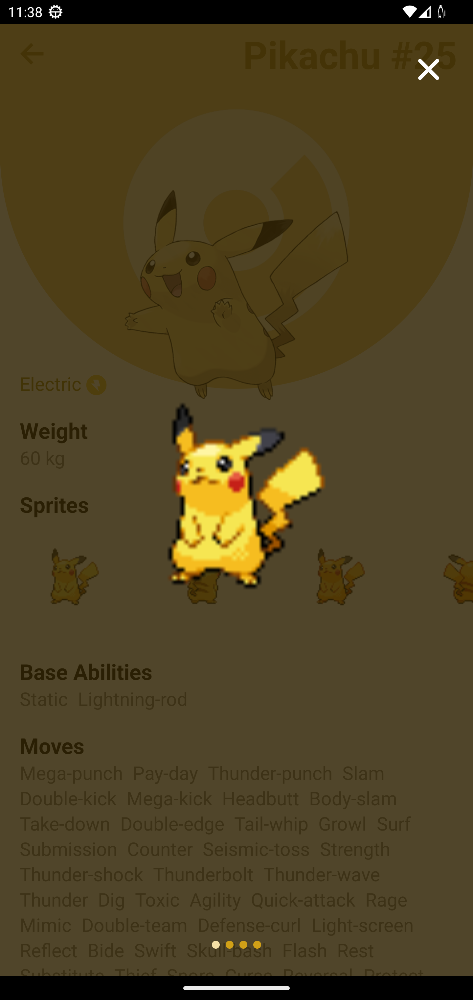

# 📚 Pokedex Project

This is a mobile application developed using React Native CLI that serves as a Pokedex. The app retrieves Pokemon data from the PokeAPI (https://pokeapi.co/api/v2/) using an API integration. It features lazy loading infinite scroll for the Pokemon list, a detailed Pokemon page with specifications, and a search bar to filter Pokemon by name. The entire project is built using TypeScript.

  
  
  

<em>Look of the App Android & iOS</em>

## ✨ Features

- **Lazy Loading Infinite Scroll:** The Pokemon list is loaded in a lazy manner, allowing for smooth scrolling and improved performance. As the user scrolls down, additional Pokemon are loaded automatically.
- **Pokemon Details Page:** Clicking on a specific Pokemon in the list opens a dedicated page displaying detailed information about the selected Pokemon, including its specifications, abilities, and other relevant details.
- **Search Bar:** The app includes a search bar that enables users to filter Pokemon by name. As the user types in the search query, the list dynamically updates to display matching Pokemon.

  
  

<em>Screenshot: Pokemon List</em>

  
  
  

<em>Screenshot: Pokemon Load More</em>

  

<em>Screenshot: Pokemon Sprites Modal</em>

## 🛠️ Technologies Used

- React Native CLI: The project is built using React Native CLI, a command-line tool for creating and managing React Native projects.
- TypeScript: The entire project is developed using TypeScript, which enhances code maintainability and enables static typing.
- PokeAPI: The app integrates with the PokeAPI (https://pokeapi.co/api/v2/) to fetch Pokemon data and display it in the app.

## ⚙️ Installation

To run the Pokedex project locally, follow these steps:

1. Ensure that you have React Native CLI installed on your machine.
2. Clone the project repository from GitHub: `git clone https://github.com/your-username/pokedex.git`
3. Navigate to the project directory: `cd pokedex`
4. Install the project dependencies: `npm install`
5. Start the application: `npx react-native run-android` on Android and `npx react-native run-ios` on iOS devices.
6. Connect your Android or iOS device/emulator and run the app using the React Native CLI commands specific to your platform.

Please note that you might need to adjust the configuration based on your development environment and device/emulator setup.

## 🚀 Usage

Once the Pokedex app is running on your device/emulator, you can interact with it using the following steps:

1. On the main screen, you will see a list of Pokemon.
2. Scroll down to load more Pokemon, utilizing the lazy loading infinite scroll feature.
3. To view detailed information about a specific Pokemon, tap on its entry in the list.
4. The app will navigate to the Pokemon details page, displaying specifications, abilities, and other relevant information.
5. To filter Pokemon by name, use the search bar at the top of the main screen. As you type, the list will dynamically update to show matching Pokemon.

Enjoy exploring the world of Pokemon using the Pokedex app!

## 📝 License

This project is licensed under the [MIT License](LICENSE).

## 🙏 Acknowledgments

The Pokedex project is made possible thanks to the incredible resources provided by the PokeAPI community (https://pokeapi.co/). Special thanks to all the contributors who have contributed to the development and maintenance of the PokeAPI.

